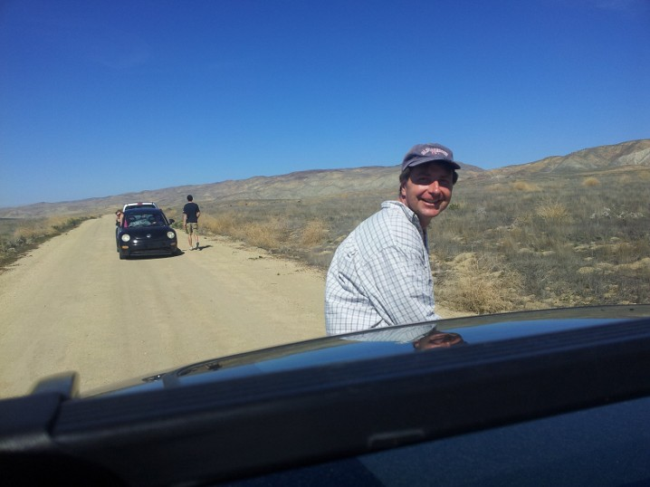

# John J. Jasbinsek
[Homepage](./index.html) | [Teaching](./teaching.html) | [Research](./research.html) | [Study Geology at Cal Poly](./study-geology-cp.html) | [Photo Albums](./photos.html)

## About Me

I am a professor geology and geophysics at [California Polytechnic State University](https://calpoly.edu),
San Luis Obispo, where I am tucked away in the [Physics Department](https://physics.calpoly.edu) for safe keeping.

- You can find out more about geology and geophysics at the [Cal Poly Geology website](https://www.calpolygeology.info/).

- [Email John @ Cal Poly](mailto:jjasbins@calpoly.edu).

<i>Enjoying the San Andreas Fault on a field trip in the Carrizo Plain</i>

## Other Miscellaneous Items

*... nothing yet ...*

