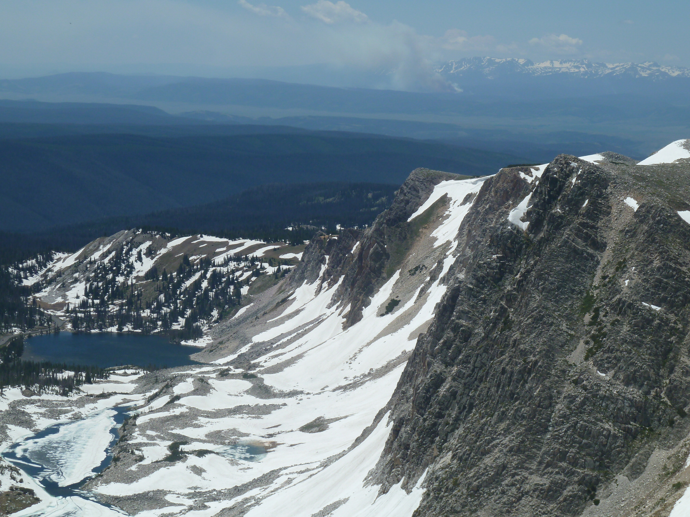

# Photos

[Homepage](./index.html) | [Teaching](./teaching.html) | [Research](./research.html) | [Study Geology at Cal Poly](./study-geology-cp.html) | [Photo Albums](./photos.html)

Atop the Snowy Range outside of Laramie, Wyoming

On this page I will ***try*** to keep photo albums of class field trips and research/projects field-work.

## Classes

**GEOL 420 Applied Geophysics**

[Fall 2020](https://www.dropbox.com/sh/3osx92ewuhohuhs/AAAem206w_foOL4Mr1quR33ca?dl=0) | [Fall 2019](https://www.dropbox.com/sh/czoqgbaehiz6xi9/AADxvUjOeLMC4Dl24YnJpYida?dl=0) | [Fall 2018](https://www.dropbox.com/sh/px7cyrsvnfft05u/AACbQ6SpN4voAdqkaY6mmGMna?dl=0) | [Fall 2017](https://www.dropbox.com/sh/pphz1k771n2my77/AAAETempMrAJyvqv0DoP2I0xa?dl=0) | [Fall 2016](https://www.dropbox.com/sh/pv9i0pnshquesu2/AAAQYepsrFrPVXSpwsx3xaIYa?dl=0) | [Fall 2015](https://www.dropbox.com/sh/lf94hc08jv1zo7u/AADkrmRSqb_L2c1cbKuRtdDua?dl=0) | [Fall 2014](https://www.dropbox.com/sh/86e1qs638efi0e1/AABjSfVmDce_glFV1CBR1IZ_a?dl=0)

**GEOL 305 Seismology and Earth Structure**

[Winter 2020](https://www.dropbox.com/sh/jo9gr653p1fllxr/AADXI9CS97dqzWdv84Z1-ERIa?dl=0) | [Winter 2018](https://www.dropbox.com/sh/n3na2jzc0aqx3fo/AACFnzMt7CBWrOTqFL3TIHBBa?dl=0) | [Fall 2015](https://www.dropbox.com/sh/vma2v241qbrs4gw/AACw66_JDlxc45TZrbd-RC3Va?dl=0) 

**GEOL 241 Physical Geology Laboratory**

[Winter 2021](https://www.dropbox.com/sh/5938exe8a1qqiqc/AABaChvILGaiLqnUSZEUl0h0a?dl=0) | [Spring 2019](https://www.dropbox.com/sh/q4jzzc0y179qn8i/AAAdrag_skUqEXzDktECjMUVa?dl=0) | [Spring 2018](https://www.dropbox.com/sh/eadww20ymj32hua/AACvvckFDGa5GU8NBzImXj9Ta?dl=0) | [Spring 2017](https://www.dropbox.com/sh/fcjc3qoitmtaj1f/AAA-e2xdvPb8wGbT7jtsWo8ba?dl=0)

**GEOL 206 Geologic Excursions**

[Spring 2019](https://www.dropbox.com/sh/oe90j17dj4hnpn4/AADoOEFCktuljbFfKHIajvhja?dl=0) | [Spring 2018](https://www.dropbox.com/sh/ivvocvj5xf02t0f/AADO7paBRoBWCxnddM1EFPtLa?dl=0) | [Fall 2016](https://www.dropbox.com/sh/xv7eeg1qyopqg2d/AAAAop0HI7rTY8XqGaA12yMRa?dl=0)

## Research Projects

**Hydrologic Response to Meadow Restoration in the Southern Cascades:** [Link]()

**Cal Poly Seismic Network:** [Link]()

**Yucca Valley Electrical Resistivity Imaging of Aquifer Recharge and Faults:** [Link]()

**Hydrogeology of the Rinconada Fault:** [Link]()

**Electrical Resistivity Imaging of Aquifer Structure in Los Alamos, CA:** [Link]()

**Santa Rosa Creek Recharge Project - Electrical Resistivity Imaging:** [Link]()

## Personal

Some photo albums from my hikes, bikes, and backpacks:

[Yellow Aster Butte]() near Mt. Baker (northern Washington)

