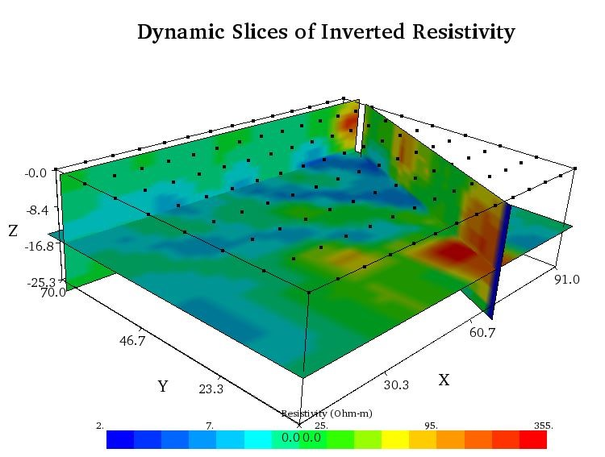
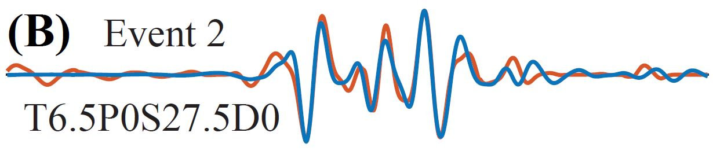

# Research

[Homepage](./index.html) | [Teaching](./teaching.html) | [Research](./research.html) | [Study Geology at Cal Poly](./study-geology-cp.html) | [Photo Albums](./photos.html)

I work in two areas of geophysics: **Near-surface Geophysics** and **Global Seismology**.
I supervise students in independent study and senior project research in these areas. 

Below are two brief descriptions of recent/current projects in these two areas.

If you are a student interested in these types of research topics, please feel free to [email me](mailto:jjasbins@calpoly.edu).

## Near-surface Geophysics

**Electrical resistivity imaging of a potential water recharge site.**

<i>3D Electrical Resistivity Tomography of a potential stream recharge site in the Santa Rosa Creek watershed (Cambria, CA)</i>

 

The above figure shows a nearly continuous clay layer near 15 meters depth making the site not a good general candidate for water recharge. However near 60 meters on the *x-axis* is a high resistivity feature that punches through the clay layer. This location is potentially coarser sediment (part of a paleochannel?) that may provide a pathway for recharge. 

The geophysical survey provides insight into where to spend time, energy, and importantly *dollars*, in exploratory wells and/or soil logs to ground truth the material structure.

## Global Seismology

**Ultra-low velocity zone studies with PcP.**

Anomalous reflected PcP waveform from the earth’s core-mantle boundary (2,900 km deep). The red trace is the observed data and the blue trace is modeled data by inserting a 6.5 km thick layer (an *ultra-low velocity zone*, or ULVZ) above the core-mantle boundary where the S-wave velocity is decreased by 27.5%. It is striking that the model fit does not improve by varying the P-wave velocity or density. In fact, many closely spaced reflection points reflect quite distinct models although only two general models are needed. This is evidence that the ULVZ structure that is being sampled is highly heterogeneous in three-dimensions.