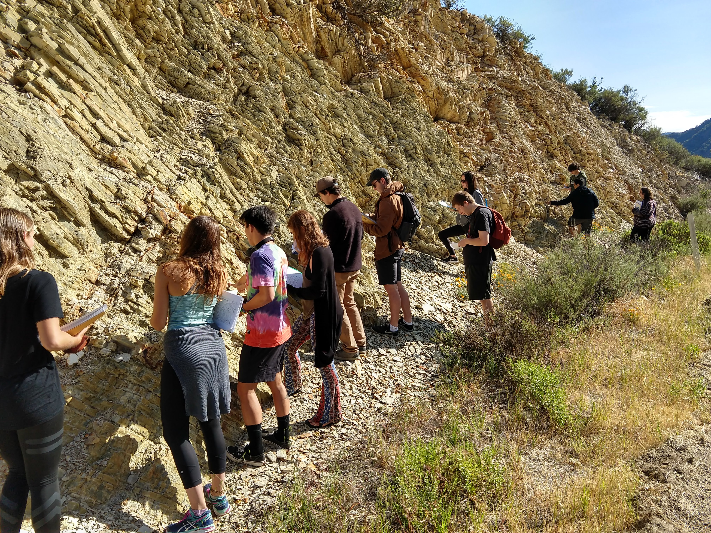

# Study Geology at Cal Poly

[Homepage](./index.html) | [Teaching](./teaching.html) | [Research](./research.html) | [Study Geology at Cal Poly](./study-geology-cp.html) | [Photo Albums](./photos.html)

**Visit the [Cal Poly Geology](https://www.calpolygeology.info) website for more detailed information.**

The Geology Program at Cal poly is jointly offered by faculty in the Physics Department and the
Natural Resources & Environmental Earth Sciences (NRES) Department.

To major in geology, enroll in the **B.S. Program in Environmental Earth and Soil Sciences** and
select the **Geology Concentration**.

The Geology Concentration is designed for all of:
- The required educational preparation for the Professional Geologist (PG) Licensure in California

> Additional work experience requirements also apply - **becoming a PG is a major professional accomplishment.**

- Graduate school in geology or other areas of the earth sciences
- To work as a geologist in private or government settings.Feel free to [email me](mailto:jjasbins@calpoly.edu) or [geology@calpoly.edu](mailto:geology@calpoly.edu) with any questions.

Cal Poly Geology _very occasionally_ tweets: [@CalPolyGeology](https://twitter.com/CalPolyGeology)

