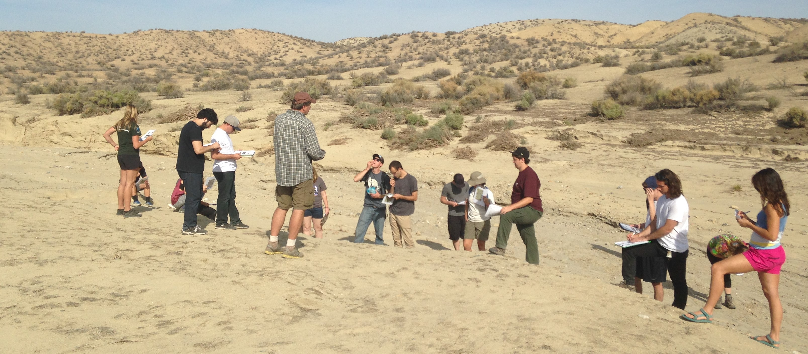

# Teaching

[Homepage](./index.html) | [Teaching](./teaching.html) | [Research](./research.html) | [Study Geology at Cal Poly](./study-geology-cp.html) | [Photo Albums](./photos.html)

Below are courses I teach with links to simple websites (simple like this one!) that I use as supplements to the in-class material and activities.

- [GEOL 102](https://tinyurl.com/geol-102) Survey of Geology
- [GEOL 201](https://tinyurl.com/geol-201) Physical Geology
- [GEOL 206](https://tinyurl.com/geol-206) Geologic Excursions
- [GEOL 241](https://tinyurl.com/geol-241) Physical Geology Laboratory
- [GEOL 301](https://tinyurl.com/geology-301) Physical Models in the Geosciences
- [GEOL 303](https://tinyurl.com/geology-303) Computation and Visualization in the Geosciences
- [GEOL 305](https://tinyurl.com/geology-305) Seismology and Earth Structure
- [GEOL 420](https://tinyurl.com/geol-420) Applied Geophysics
- [PHYS 410](https://tinyurl.com/physics-410) Physics of Solid Earth